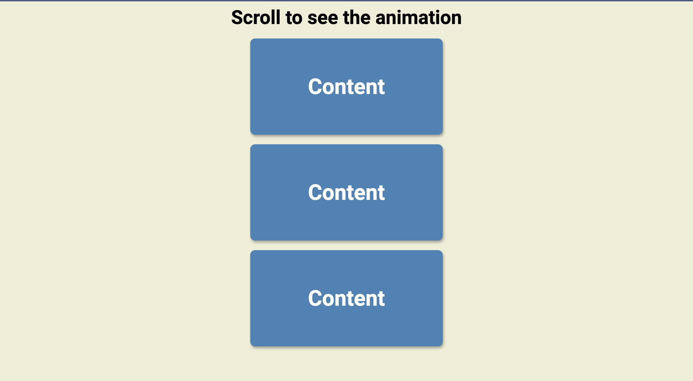

# 50 Projects in 50 Days - Scroll Animation

This is a code along project in the [50 Projects In 50 Days - HTML, CSS & JavaScript Udemy Course](https://www.udemy.com/course/50-projects-50-days/). Sharpen your skills by building 50 quick, unique & fun mini projects.

## Table of contents 😌

- [Overview](#overview)
  - [The project](#the-project)
  - [Screenshot](#screenshot)
  - [Links](#links)
- [My process](#my-process)
  - [Built with](#built-with)
  - [What I learned](#what-i-learned)
  - [Continued development](#continued-development)
  - [Code snippets](#im-really-proud-of-these-code-snippets%EF%B8%8F)
  - [Useful resources](#useful-resources)
- [Author](#author)
- [Acknowledgments](#acknowledgments)

## Overview👋🏾

Welcome to the 6<sup>th</sup> mini-project of the course!

### The project😥

In this project users will be able to:

- Build a responsive site that displays an animated scroll function.

### Screenshot🌇



### Links👩🏾‍💻

- Solution URL: (https://github.com/MaianneThornton/50in50_ScrollAnimation)
- Live Site URL: (https://chic-gumption-179776.netlify.app/)

## My process💭

This is a simple project that I started by marking out initial classes in the html file to be later used for styling. Next I began styling the css by styling the boxes and the classes to be later used for functionality. I then added functionality by way of JavaScript to switch between classes when the user scrolls down the page. This creates the animation where the boxes slide into view.

### Built with👷🏾‍♀️

- Semantic HTML5 markup
- CSS custom properties
- Flexbox
- JavaScript

### What I learned👩🏾‍🏫

I learned the logic behind making animated boxes slide into view. I will be applying this to future projects where needed.

I also learned how to use "getBoundingClientRect" to create a DOMRect to accurately pinpoint the positioning of a rectangular section. (see [Useful resources](#useful-resources) for more information).

### Continued development🔮

In the future I plan on continuing to practice positioning elements using flexbox, and using different selectors such as nth of type to select elements.

I also plan on continuing to practice using event listeners to make my pages more functional.

I also plan on continuing to learn the best ways to phrase git commits, so that future viewers can fully understand the changes that have occurred.

### I'm really proud of these code snippets✂️

```css
/* moves all the even boxes to the left side */
.box:nth-of-type(even) {
  transform: translateX(-400%);
}
```

```js
function checkBoxes() {
  // trigger point to determine when the box should scroll into view by using the innerHeight of the box
  const triggerBottom = window.innerHeight / 5 * 4

  boxes.forEach(box => {
    // https://developer.mozilla.org/en-US/docs/Web/API/Element/getBoundingClientRect
    const boxTop = box.getBoundingClientRect().top
    if (boxTop < triggerBottom) {
      box.classList.add('show')
    } else {
      box.classList.remove('show')
    }
  })
}
```

### Useful resources📖

- [Resource 1](https://developer.mozilla.org/en-US/docs/Web/API/Element/getBoundingClientRect) - This resource helped me to better understand the getBoundingClientRect element and how to use it. The diagram made the concept so easy to understand which properties to access.
- [Resource 2](https://www.freecodecamp.org/news/how-to-write-better-git-commit-messages/) - This is an amazing article which helped me write better commit messages. I'd recommend it to anyone still learning this concept.

## Author🔎

- Website - [Portfolio Site](https://maiannethornton-portfolio.netlify.app/)
- Frontend Mentor - [@MaianneThornton](https://www.frontendmentor.io/profile/MaianneThornton)
- GitHub - [@MaianneThornton](GitHub.com/MaianneThornton)
- Twitter - [@MaianneThornton](https://twitter.com/MaianneThornton)
- LinkedIn - [@MaianneThornton](https://www.linkedin.com/in/maiannethornton/)

## Acknowledgments🙏🏾

Special Thanks go to [Brad Traversy](http://www.traversymedia.com/) and [Florin Pop](http://www.florin-pop.com/) creating the course and making reviewing concepts fun 😊.
